# Jira Automation Deduplication

Use a Jira global automation rule to deduplicate Kentik alert state-change webhooks. The rule receives a Kentik webhook, checks whether an open Jira work item already exists for the same Kentik alert, and then either updates the existing work item or creates a new one.

This prevents repeated Kentik state changes for the same alert from creating duplicate Jira tickets.

## Automation Flow

The rule follows this shape:

1. `Incoming webhook` receives the Kentik alert payload.
2. `Lookup work items` searches Jira for an open Kentik ticket matching the incoming alert id.
3. `If` `{{lookupIssues.size}}` is greater than `0`, the rule comments on the existing ticket.
4. `Else`, the rule creates a new Jira ticket from the webhook payload.

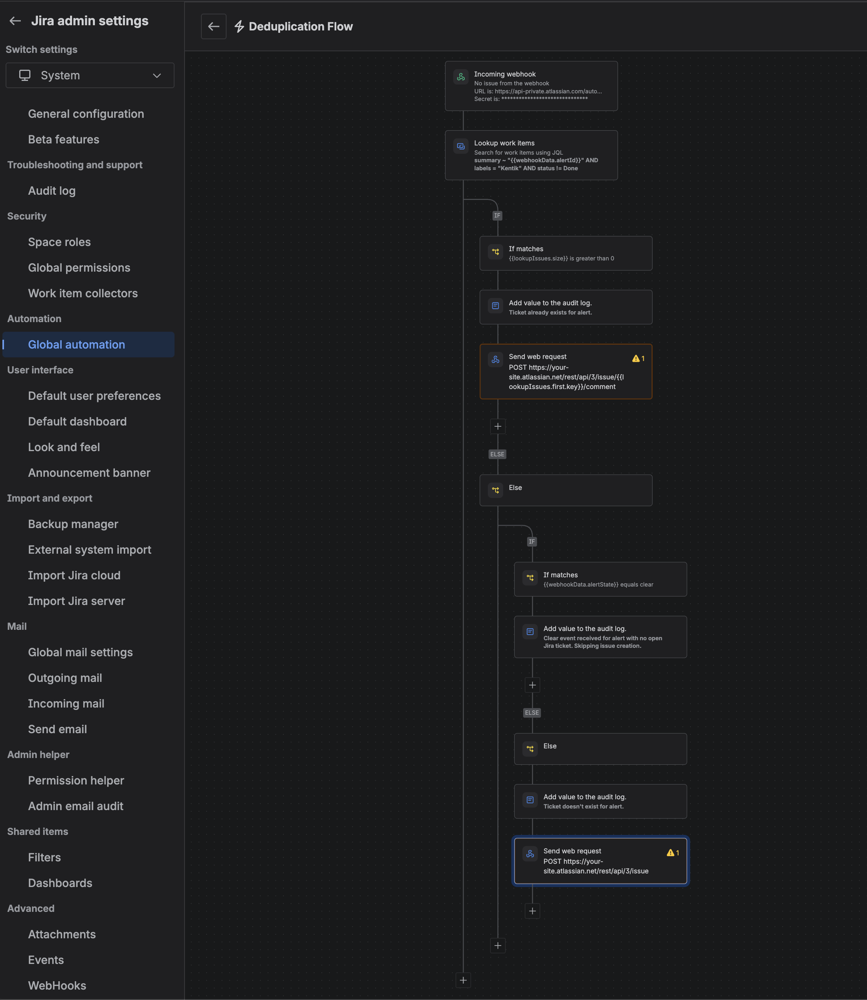

The examples below use smart values from the Kentik webhook payload, including `{{webhookData.alertId}}`, `{{webhookData.alertState}}`, `{{webhookData.descriptionRaw}}`, and `{{webhookData.rawPayload}}`.

```json
{
	"alertId": "019efe40-9837-749e-8f8d-f6d46b725784",
	"alertState": "alarm",
	"descriptionRaw": { "type": "doc", "version": 1, "content": [] },
	"rawPayload": "{... Jira issue create payload ...}"
}
```

## Create the Incoming Webhook Trigger

In Jira, go to site settings, then `Automation`, and create a new global rule.

Add an `Incoming webhook` trigger.

Configure the trigger with:

- `No work items from the webhook`.
- A generated webhook URL.
- A generated secret.

Save the webhook URL and secret. You will use them later when configuring the Kentik notification channel.

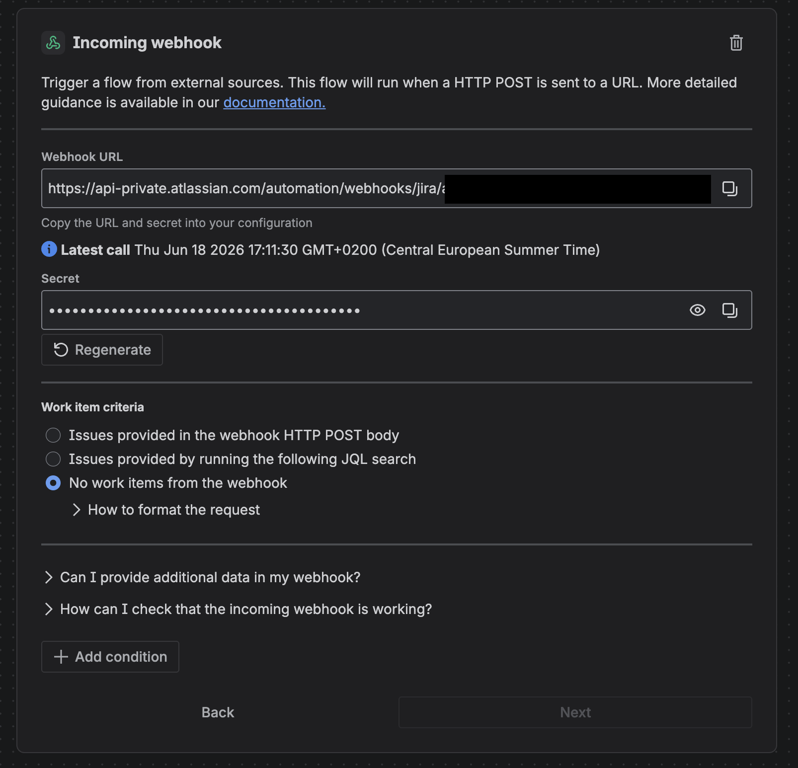

Do not commit webhook URLs, webhook secrets, Jira API tokens, or site-specific credentials to this repository.

## Look Up Existing Work Items

Add a `Lookup work items` action after the webhook trigger.

Use JQL that finds open Jira work items for the same Kentik alert id. The screenshot example uses the alert id in the issue summary and a `Kentik` label:

```jql
summary ~ "{{webhookData.alertId}}" AND labels = "Kentik" AND status != Done
```

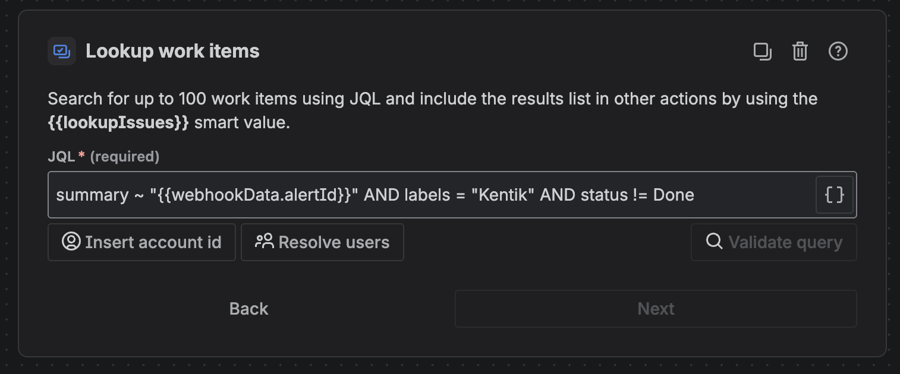

## Add the Duplicate Check

Add an `If block` after the lookup action.

Configure a smart values condition:

```text
First value: {{lookupIssues.size}}
Condition: greater than
Second value: 0
```

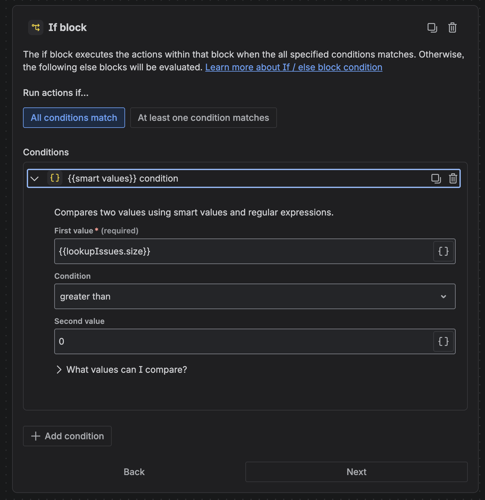

This branch runs when the lookup found an existing open Jira work item for the Kentik alert.

## Existing Ticket Branch

Inside the `If` branch, add a `Log action` so the automation audit log clearly shows that the webhook was deduplicated:

```text
Ticket already exists for alert.
```

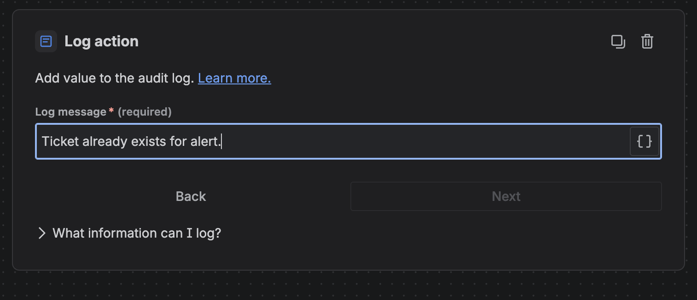

Then add a `Send web request` action that posts a comment to the existing Jira work item.

Use the first lookup result in the URL:

```text
https://your-site.atlassian.net/rest/api/3/issue/{{lookupIssues.first.key}}/comment
```

Configure the request:

```text
HTTP method: POST
Web request body: Custom data
Header: Content-Type = application/json
Header: Authorization = Basic {{base64Encode("user@example.com:JIRA_API_TOKEN")}}
```

Use a comment body that matches the payload format your webhook sends. Add the `kentik-origin` comment property so if the Forge app is used for bi-directional communication, it can identify this as a Kentik-generated deduplication comment and avoid sending it back to Kentik.

```json
{
	"body": {{webhookData.descriptionRaw}},
	"properties": [
		{
			"key": "kentik-origin",
			"value": {
				"source": "kentik-jira-automation-deduplication"
			}
		}
	]
}
```

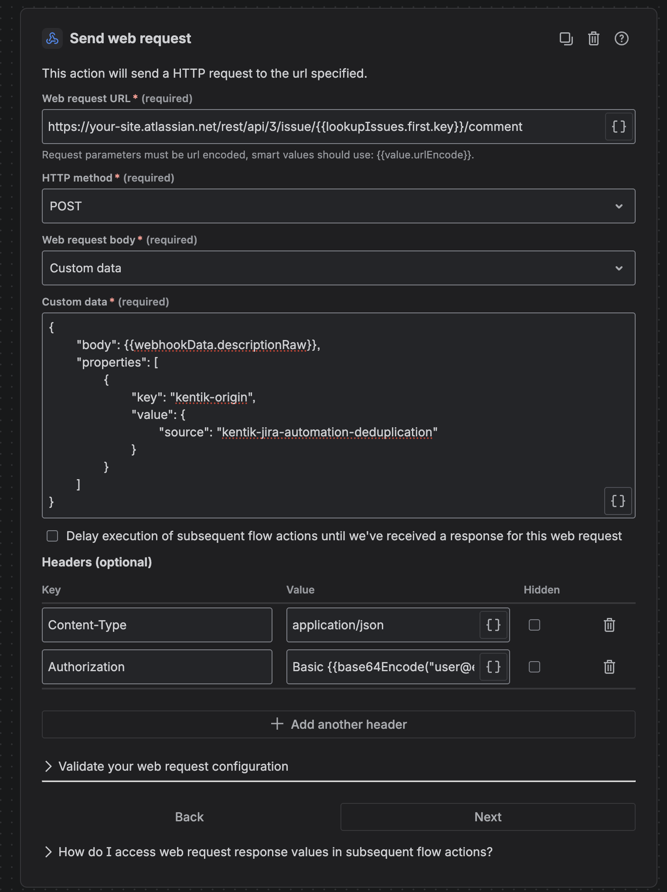

## New Ticket Branch

Add an `Else block` for the case where no existing open work item was found.

Inside the `Else` branch, add an `If block` to stop clear-state webhooks from creating new work items.

Configure the nested `If block` with a smart values condition:

```text
First value: {{webhookData.alertState}}
Condition: equals
Second value: clear
```

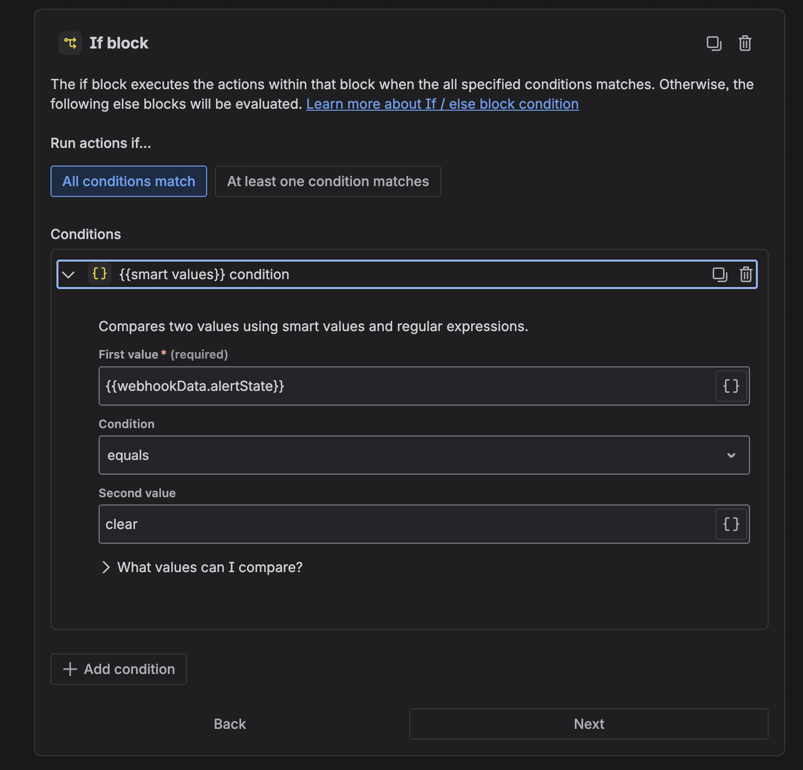

Inside the clear-state `If` branch, add a `Log action`:

```text
Clear event received for alert with no open Jira ticket. Skipping issue creation.
```

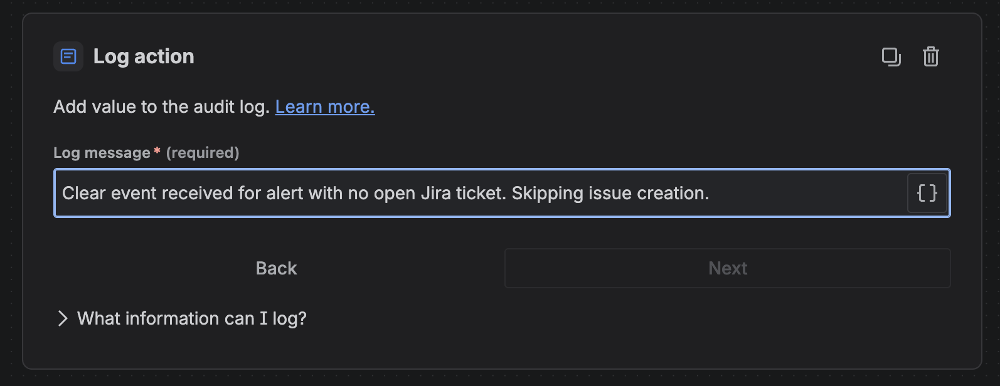

Add an `Else block` under the clear-state check. This nested `Else` branch runs when no open Jira work item exists and the incoming Kentik alert is not clear.

Inside this nested `Else` branch, add a `Log action`:

```text
Ticket doesn't exist for alert.
```

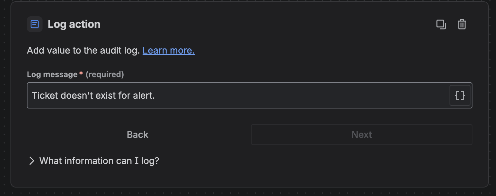

Inside that nested `Else` branch, add a `Send web request` action to create a new Jira issue:

```text
https://your-site.atlassian.net/rest/api/3/issue
```

Configure the request:

```text
HTTP method: POST
Web request body: Custom data
Header: Content-Type = application/json
Header: Authorization = Basic {{base64Encode("user@example.com:JIRA_API_TOKEN")}}
```

Use the issue-create payload from the webhook:

```text
{{webhookData.rawPayload}}
```

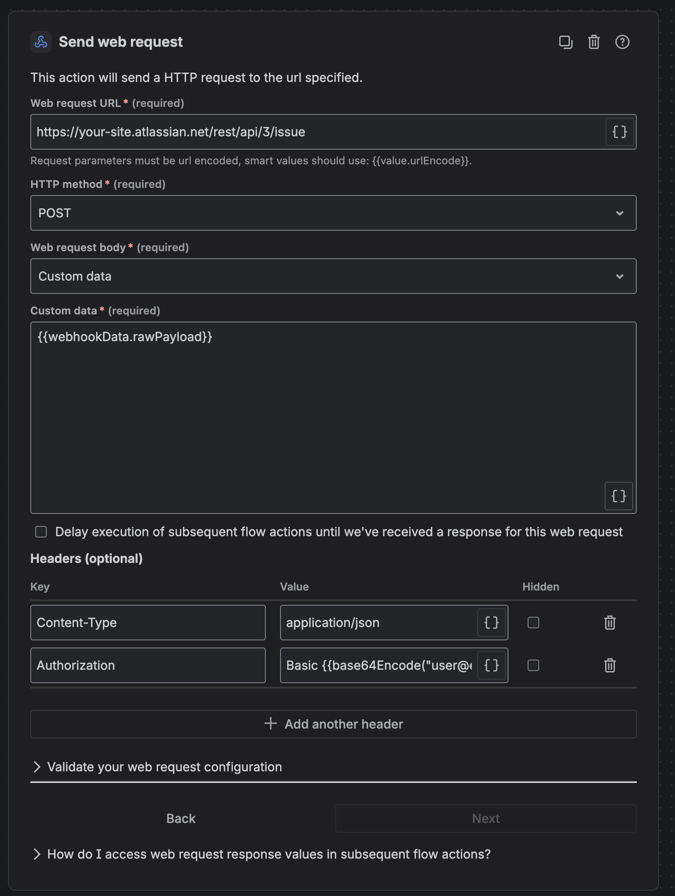

The create-issue payload must be valid for Jira's `POST /rest/api/3/issue` endpoint. It usually needs at least `project`, `issuetype`, `summary`, and `description` under `fields`.

## Authentication Notes

The `Send web request` actions call Jira's REST API, so they need Jira authentication.

Use a Jira API token for the automation user and add the authorization header as a hidden value if your Jira automation UI supports hiding it:

```text
Authorization: Basic {{base64Encode("user@example.com:JIRA_API_TOKEN")}}
```

Replace `user@example.com` and `JIRA_API_TOKEN` with the automation user's Jira email address and API token.

Do not include real credentials in screenshots or committed documentation.

## Configure the Kentik Notification Channel

After the Jira automation rule is configured, create or edit the Kentik notification channel that should send alert state changes to Jira.

Configure the channel with:

- Type: `Jira Cloud`.
- Connection Type: `Webhook (Automation)`.
- URL: the incoming webhook URL generated by the Jira automation trigger.
- Custom header name: `X-Automation-Webhook-Token`.
- Custom header value: the secret generated by the Jira automation trigger.
- Project Key: the Jira project key where new issues should be created.
- Issue Type: the Jira issue type to create when no existing issue is found.

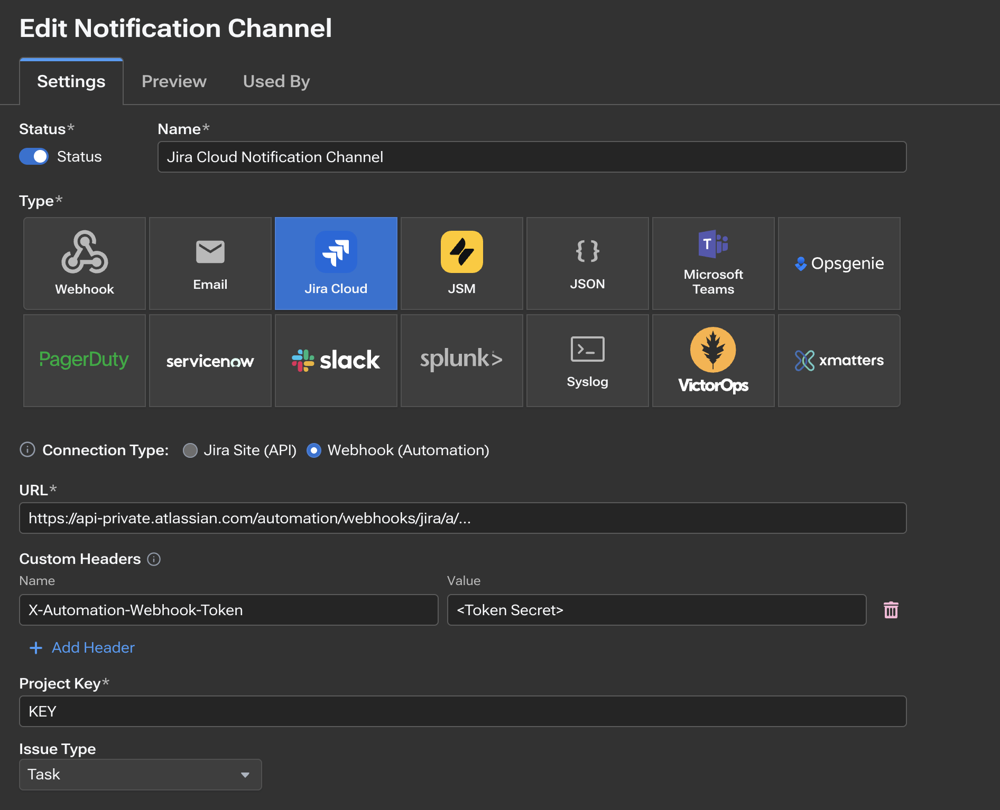

The webhook URL and token are site-specific secrets. Keep them out of source control, screenshots, support tickets, and shared docs unless they are redacted.

## Testing the Rule

Before enabling the rule broadly:

1. Point a test Kentik webhook at the Jira automation incoming webhook URL.
2. Send a webhook payload for a new alert id.
3. Confirm the nested non-clear `Else` branch logs `Ticket doesn't exist for alert.` and creates a Jira issue.
4. Send another webhook payload with the same `alertId`.
5. Confirm the `If` branch logs `Ticket already exists for alert.` and comments on the existing issue.
6. Review the automation audit log for the lookup JQL, branch condition, and web request responses.

After testing, remove any temporary log actions that include alert metadata you do not want retained in Jira automation logs.
