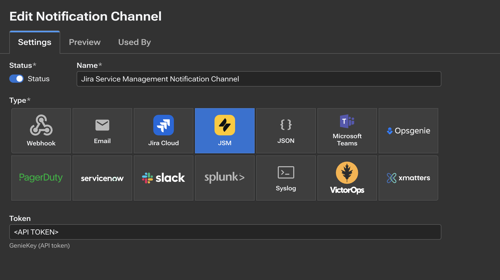

# Jira Service Management Alert Deduplication

Customers who want Kentik alert state changes to create Jira Service Management alerts instead of Jira tickets can use the Kentik JSM notification channel.

With this approach, Jira Service Management Operations handles alert deduplication. Repeated Kentik state changes for the same alert update one JSM alert instead of creating duplicate records. New state changes, AI investigation updates, escalations, and similar events are added to the existing alert timeline as notes.

## How It Works

The flow has two parts:

1. In Jira Service Management Operations, create an API integration and copy its token.
2. In Kentik, configure a `JSM` notification channel with that token.

After this is configured, Kentik sends alert state changes to JSM Operations. JSM uses the integration payload to correlate related events and deduplicate them into a single alert.

## Configure the JSM Operations Integration

In Jira, open the site where Jira Service Management Operations is enabled.

Go to `Operations`, select the team that should receive Kentik alerts, then open `Integrations`.

Create a new integration and select the `API` integration type.

The API integration provides a token. Copy that token for the Kentik notification channel.

Do not commit the JSM API integration token to source control or include it in unredacted screenshots.

## Configure the Kentik JSM Notification Channel

In Kentik, create or edit the notification channel that should send alert state changes to Jira Service Management.

Configure the channel with:

- Type: `JSM`.
- Token: the token from the JSM Operations API integration.

## Deduplication Behavior

Jira Service Management deduplicates Kentik alert state changes automatically.

For a single Kentik alert:

- The first state change creates one JSM alert.
- Later state changes update that same JSM alert.
- AI investigations, escalations, and related updates are added as notes on the existing alert.

This is different from the Jira Automation approach, where automation explicitly searches for an existing Jira ticket and decides whether to create a new issue or comment on an existing one.

## Tickets, Incidents, and Syncs

Users can create Jira tickets or incidents from JSM alerts manually, or automatically with Jira Service Management automations such as Syncs.

Syncs can also automate follow-up behavior after an alert is linked to a ticket or incident. For example, a Sync can copy new notes from a JSM alert to the linked ticket so investigation updates, escalations, and AI investigation notes remain visible in the ticket workflow.

While Forge app access to JSM Operations alert metadata is limited by Atlassian `JSDCLOUD-18783`, configure ticket or incident creation from Kentik alerts to include:

- A `Kentik` label on the created Jira issue.
- The Kentik alert or alarm UUID at the end of the summary in square brackets, such as `[019efe40-9837-749e-8f8d-f6d46b725784]`.

The Forge app can use this supported Jira issue data as an interim fallback while still keeping the native linked-alert API lookup in place for future Atlassian support.

## When to Use This Approach

Use the JSM notification channel when customers want Kentik alerts to appear as JSM Operations alerts and use JSM's native alert lifecycle.

Use the Jira automation deduplication flow when customers want Kentik alert state changes to create or update regular Jira issues directly.

## Testing

Before enabling this notification channel broadly:

1. Create the JSM Operations integration and copy its token.
2. Configure the Kentik `JSM` notification channel with the token.
3. Send a test Kentik alert state change.
4. Confirm a JSM alert is created.
5. Send another state change for the same Kentik alert.
6. Confirm JSM updates the existing alert and adds the new event as a note instead of creating a duplicate alert.
